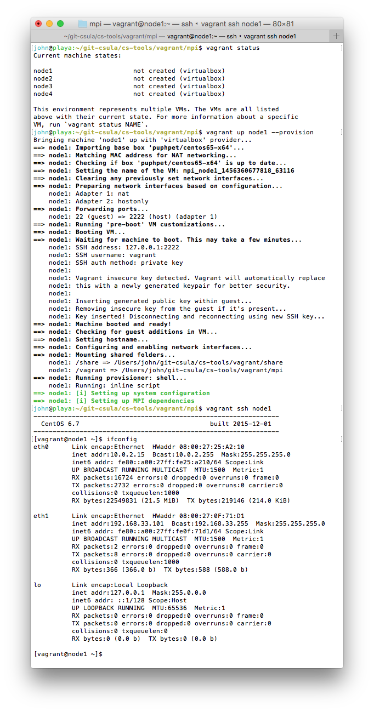

# MPI using Vagrant

This tutorial will walk students through the process of setting up a reasonable environment for MPI programming using [Vagrant](http://www.vagrantup.com).  

## Background

We will deploy a portable cluster with the following configuration:
* Four nodes running Linux CentOS 6.5
* mpich 3.4.1 MPI software

The compute nodes will talk to each other using a private host-only network setup using the following network configuration.

```
node1 192.168.33.101
node2 192.168.33.102
node3 192.168.33.103
node4 192.168.33.104
```

### Start up the cluster

To boot up your cluster, execute the following:

```
cd cs-tools/mpi
vagrant up node1
vagrant up node2
vagrant up node3
vagrant up node4
```

If all goes well all four nodes should boot up cleanly.  


### Access the cluster

* If you are a Windows user, please use [putty.exe](http://www.chiark.greenend.org.uk/~sgtatham/putty/download.html) to log into the guest OS.  

The `host` and `port` information is shown when you boot up the guest OS:

```
==> node1: Waiting for machine to boot. This may take a few minutes...
    node1: SSH address: 127.0.0.1:2222
    node1: SSH username: vagrant
    node1: SSH auth method: private key

* If you are a Mac or Linux user, you can simply type `vagrant ssh node1`

## Your First MPI program

Login into `node1` and create the following program `hello.c`

```c++
#include <stdio.h>
#include <stdlib.h>
#include <time.h>
#include <mpi.h>

int main(int argc, char** argv)
{
  // Initialize the MPI environment
  MPI_Init(NULL, NULL);

  // Get the number of processes
  int world_size;
  MPI_Comm_size(MPI_COMM_WORLD, &world_size);

  // Get the rank of the process
  int world_rank;
  MPI_Comm_rank(MPI_COMM_WORLD, &world_rank);

  // Get the name of the processor
  char processor_name[MPI_MAX_PROCESSOR_NAME];
  int name_len;
  MPI_Get_processor_name(processor_name, &name_len);

  // Print off a hello world message
  printf("Hello world from processor %s, rank %d"
         " out of %d processors\n",
         processor_name, world_rank, world_size);

  // Finalize the MPI environment.
  MPI_Finalize();

  return 0;
}
```

To compile the program, run the following command:

```
mpicc -o /share/hello hello.c
```

### Run the MPI program

Create `hostfile` with the following:

```
192.168.33.101
192.168.33.102
192.168.33.103
192.168.33.104
```

To run your program execute the following command:

```
mpirun -n 4 -f hostfile /share/hello
```

The `hello.c` program demonstrates a simple MPI program that does not perform any communications.

Now, let's do a slightly more complicated program.  For this task, your program will pass a `token` around a ring.  The solution is in the [potato.c](../share/MPI/potato.c) code.
